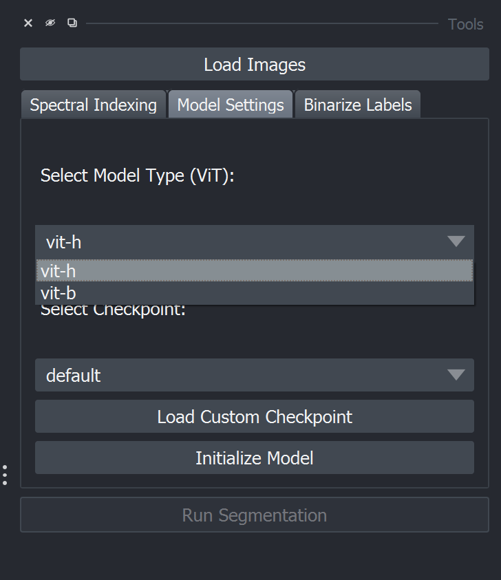

# Image loading and managing

### **Supported File Formats**:

* Hyperspectral: `.dat`, `.tif`, `.raw`
* RGB: `.png`, `.jpg`, `.bmp`

### **How to import images**:

<figure><figcaption></figcaption></figure>

1. Click the `Load Images` button in the main interface.
2. Select one or multiple image files from your system.
3. Ensure `.hdr` files are present for `.dat` or `.raw` files (if not, the tool will prompt you to provide them).
4. Navigate through the loaded batch of images using the `Previous Image` and `Next Image` buttons.

Find more detailed instructions on the next page.

