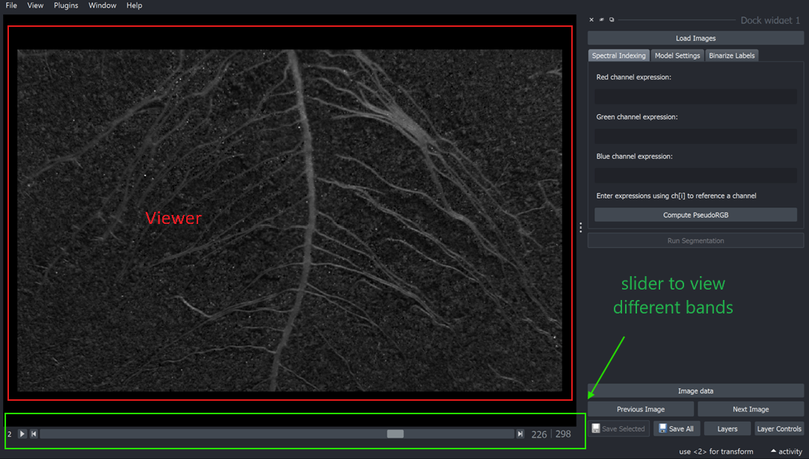

# Import

### Load images

To load images, click the `Load Images` button in the dock widget and select a batch of hyperspectral or RGB images.

[supported-image-formats.md](supported-image-formats.md "mention") are PNG, JPG, TIF, BMP, RAW, and DAT.

Navigate through the loaded batch of images using the `Previous Image` and `Next Image` buttons.

<figure><figcaption></figcaption></figure>

### Viewer

Upon loading, the first image in the batch will be displayed in the **viewer** by default.&#x20;

If the data is hyperspectral, slide the horizontal scroll bar under the viewer to view different bands. RGB images will be displayed as color images by default and will not have the sliding scroll bar to view individual bands.

<figure><figcaption></figcaption></figure>

#### Short visual demo of viewer



