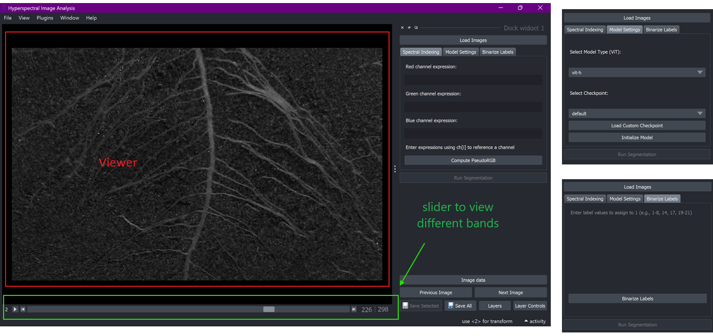

# User Interface

You&#x20;

<figure><figcaption>
GSense launch screen
</figcaption></figure>

### Load images

<figure><figcaption></figcaption></figure>

After loading a batch of hyperspectral images, the first image will be displayed in the **viewer**. Slide the horizontal scroll bar under the viewer to view different bands.

RGB images will be displayed as color images by default and will not have the sliding scroll bar to view individual bands.

<figure><figcaption></figcaption></figure>

