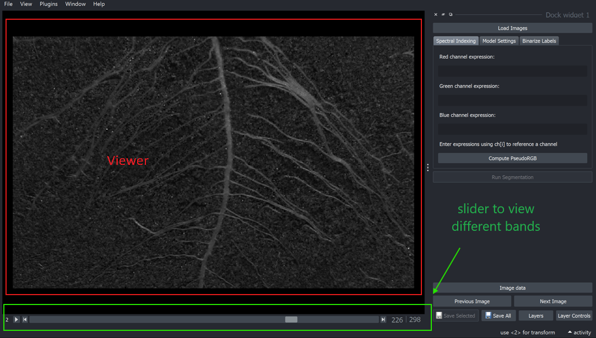

# User Interface

You&#x20;

<figure><figcaption>
GSense launch screen
</figcaption></figure>

### Load images

<figure><figcaption></figcaption></figure>

Click the `Load Images` button to select a batch of hyperspectral or RGB images to load into GSense. [supported-image-formats.md](../../basics/import/supported-image-formats.md "mention") are PNG, JPG, TIF, BMP, RAW, and DAT.

Navigate through the loaded batch of images using the `Previous Image` and `Next Image` buttons.

### Viewer

When images are loaded, the first image will be displayed in the **viewer** by default. If the data is hyperspectral, slide the horizontal scroll bar under the viewer to view different bands.

RGB images will be displayed as color images by default and will not have the sliding scroll bar to view individual bands.

<figure><figcaption></figcaption></figure>

