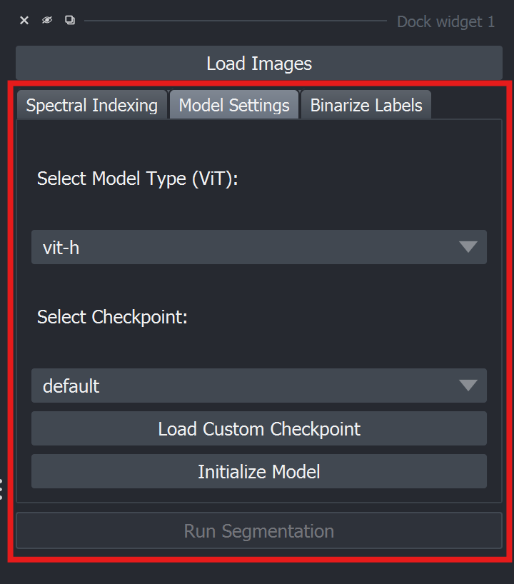
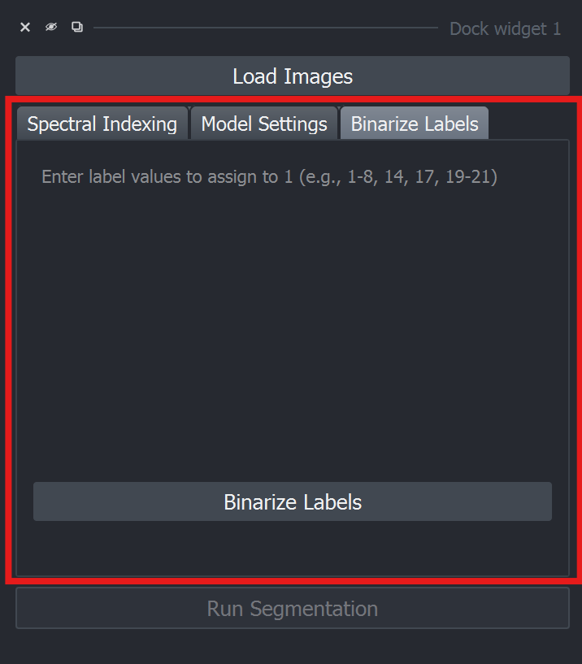

# Main tabs

<figure><figcaption></figcaption></figure>

[markdown.md](../../basics/markdown.md "mention")

Apply spectral indices to images to generate pseudo-RGB (false-color) images.

<figure><figcaption></figcaption></figure>

[editor](../../basics/editor/ "mention")

Partition generated pseudo-RGB images into meaningful segments for downstream computer vision applications.

<figure><figcaption></figcaption></figure>

[binarizer.md](../../basics/binarizer.md "mention")

The label binarizer functionality allows you to convert the labels in generated masks to binary labels for downstream machine learning model training purposes and other applications.&#x20;

<figure><figcaption></figcaption></figure>

